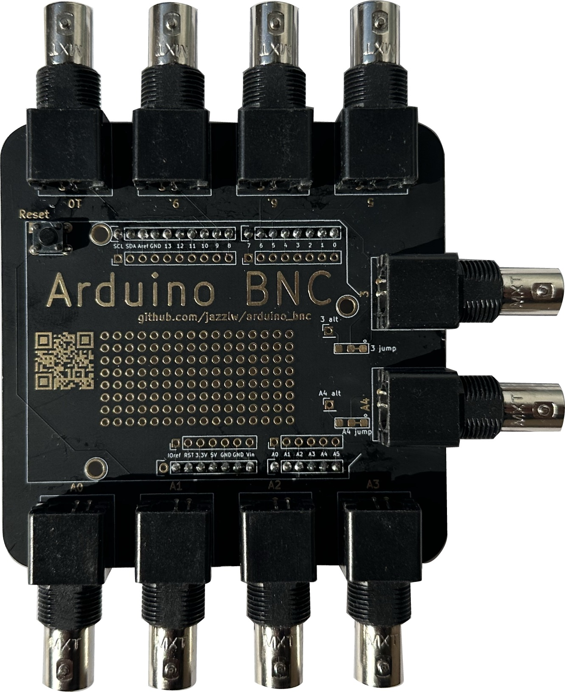

# Arduino BNC Shield
<!--  -->

*Now orderable from my [Etsy store](https://www.etsy.com/listing/1526648413/arduino-bnc-shield)*

**NOTE:** I've just made a new version with some small changes and upgrades, and it might be worth waiting for. You can see it in the `dev` branch, and once I get some and test it I'll update the `main` branch, should be in the first or second week of august, 2023.

The Arduino BNC Shield is a very simple way to reliably connect an Arduino to one or more BNC
cables.

Especially in science, it is very common to use an Arduino to trigger a camera or behavioral system or LED from a computer, and most of the commercially available devices that are triggered have BNC input connections. This often leads to flaky and problematic ways of connecting the Arduino to the BNC cable, and thus experimental setups that are delicate.  This simple shield aims to address this problem and give a reliable solution, without any complicated parts or difficult soldering.

## Features

Up to ten BNC ports attached to different pins on the Arduino.  Five of these pins (3, 5, 6, 9, 10) can be used for digital input our output, and all are PWM capable.  The other five (A0 - A4) can be used for reading analog input voltages, as well as also being usable for digital IO.

There is also a prototyping area with 0.1 inch pitch through holes, in case you want to add any extra parts such as sensors or digital to analog  converters (DACs) or similar. Two of the BNC ports (3 and A4) have jumpers so that they can be easily attached to something in the prototyping area, such as a DAC, instead of to their Arduino pins. See [adding an analog voltage output](docs/adding_analog_out.md) for details and instructions.

## Getting one

To make it super easy to get one of these, I've just put some up on an [Etsy store](https://www.etsy.com/listing/1526648413/arduino-bnc-shield).  You can get just the board, made matte black with high quality immersion gold coating, as shown in the pictures above. You can also get the other parts there, and you can also order it pre-soldered if you want.

With a little more effort, the Arduino BNC Shield can be ordered easily and cheaply from any PCB board house (such as [pcbway](pcbway.com), [jlcpcb](jlcpcb.com), etc)  using the zipped gerber files in `bnc_shield_pcb/bnc_shield_gerbers.zip`. You'll need to input the size of the desired board, which is 3.6 inches by 3.6 inches. Many board houses have a deal for 5 PCBs of this size for under $10 plus shipping (although without the black solder mask or gold coating mentioned above). The only other parts you need are an Arduino Uno, some BNC jacks, and some header to connect the shield to the Arduino. The whole thing can then be easily and quickly assembled even by someone with no soldering experience using only a soldering iron and solder.

## Build Instructions

The Arduino BNC Shield was designed to be super easy and quick to assemble, even without any experience! For most use cases, all you need to do is solder some [0.1 inch male header](https://www.digikey.com/en/products/detail/sullins-connector-solutions/PRPC040SAAN-RC/2775214) onto the shield to connect it to the Arduino, and some [BNC Jacks](https://www.digikey.com/en/products/detail/sullins-connector-solutions/PRPC040SAAN-RC/2775214) to connect your BNC cables. For the header, it can be helpful to start by putting the long side of the headers into an Arduino to hold them, and then putting the shield on top to solder it. If you've never soldered before, don't worry, it's very learnable! There are many great YouTube videos and other guides on the internet to show you how, such as [this one from AdaFruit.](https://learn.adafruit.com/adafruit-guide-excellent-soldering/preparation)

Now you're ready to load some code on the Arduino with the [Arduino IDE](https://www.arduino.cc/en/software) and try it out! Check out the things in the `examples` folder for ideas.

### Required parts

You will need a few parts in order to complete the Arduino BNC shield, as shown below. For the BNC Jacks, you don't need to install all 10 if you won't be using all 10 channels, just the ones you plan to use.

|Part|Quantity|Part Number|Supplier Link|
|---|---|---|---|
|Arduino BNC Shield PCB| 1 | N/A | See above
|Arduino Uno|1|A000066 | <https://www.digikey.com/reference-designs/en/open-source-mcu-platforms/2481>|
|BNC Jack|1-10|0731375003 | <https://www.digikey.com/en/products/detail/molex/0731375003/1465136>|
|Male 0.1 in Header|2|PRPC040SAAN-RC | <https://www.digikey.com/en/products/detail/sullins-connector-solutions/PRPC040SAAN-RC/2775214>

### Optional Parts

|Part|Quantity|Part Number|Supplier Link|
|---|---|---|---|
|Reset Button|1| PTS526 SK15 SMTR2 LFS| <https://www.digikey.com/en/products/detail/c-k/PTS526-SK15-SMTR2-LFS/10056626>|
|Shield Stacking Header|1 set| 85|<https://www.adafruit.com/product/85> |
|[Digital to Analog Converter  (DAC)](docs/adding_analog_out.md) | 1| 935 |  <https://www.adafruit.com/product/935>

 This work is licensed under a <a rel="license" href="http://creativecommons.org/licenses/by-sa/4.0/">Creative Commons Attribution-ShareAlike 4.0 International License</a>.
