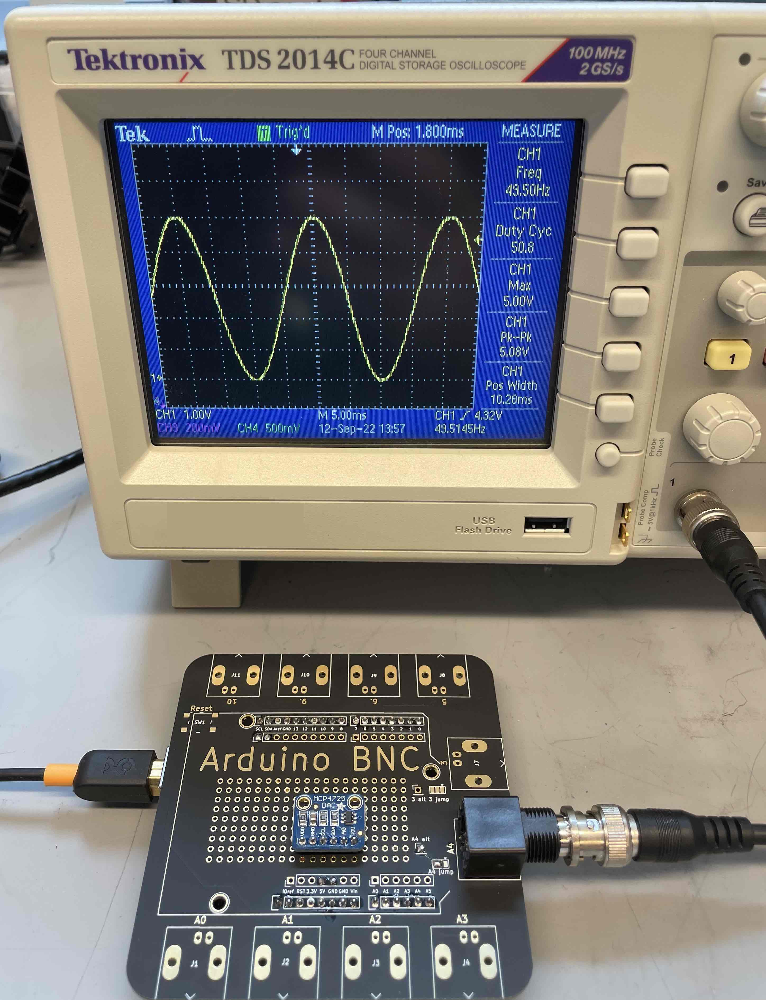
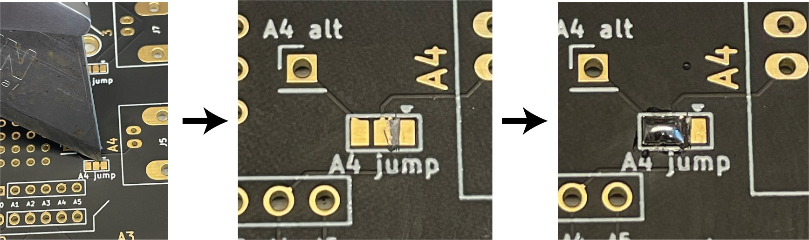
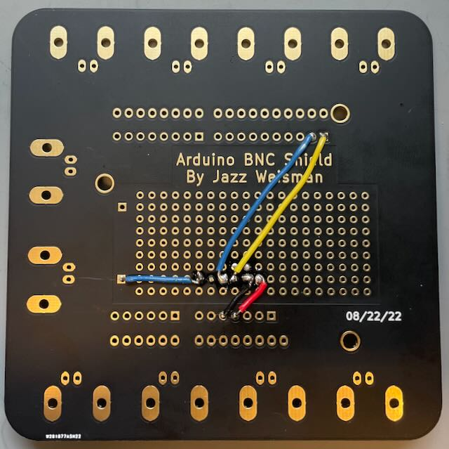

# Adding an analog voltage output

The Arduino BNC shied was designed to be simple and easy to use and build, but also to have the ability to be customized and expanded for different use cases.  The prototyping area in the center offers 0.1" through holes for adding parts, and the `A4` and `3` BNC outputs have cuttable jumpers so that they can be attached to something other than their Arduino pins.  One likely use case for these options is adding an analog voltage output.

Arduinos (and many other microcontrollers) have built in options for reading analog voltage inputs (with pins A0-A5), but they can only do digital output. The `analogWrite` function in an Arduino actually outputs a [PWM signal](https://www.wikiwand.com/en/Pulse-width_modulation) on the given pin. If you need an actual analog voltage out, you will need a [digital to analog converter](https://www.wikiwand.com/en/Digital_to_analog_converter) (DAC).  There are many different types of DAC available with different strengths, weaknesses, and communication methods. Here, we'll be using the [MCP4725 DAC board](https://www.adafruit.com/product/935) from Adafruit. [They have written a great guide](https://learn.adafruit.com/mcp4725-12-bit-dac-tutorial) that explains how to use it and has example code and lots more.

### Adding the DAC to the Shield
To add the DAC to the shield, first we need to change BNC `A4` or `3` (here A4, but you can use either) to attach to the alt pin instead of their Arduino Pin.  Do this by cutting the trace connecting the right pad to the middle one, as shown below.  You can do this by scraping with an exacto or other knife blade.  Check the continuity with a multimeter afterwards to make sure that they are no longer connected. Now use a small blob of solder to connect the left pad to the middle, as shown below.  Now the `A4` BNC is connected to the hole labeled `A4 alt` on the board, as you can verify with a multimeter.

To attach the DAC to the Arduino BNC Shield, solder some 0.1" header to the DAC board and then into the prototyping area somewhere convenient. Then connect the DAC to the matching pins on the shield as shown below. The output of the DAC is connected to the `A4 alt` point and thus to the `A4` BNC.

|DAC Board pin | BNC Shield Pin |Wire color in picture|
|---|---|---|
|Vin / VDD | 5V  | Red
|GND | GND | Black
|SCL | SCL | Yellow
|SDA | SDA | Blue (long)
Vout | A4 alt| Blue (short)

## Using it!
Now you're ready to have analog voltage output!  Download the [Adafruit library for the MCP4725](https://github.com/adafruit/Adafruit_MCP4725) from their github or using the library manager in the Arduino IDE, and load one of their examples onto the Arduino to try it out!